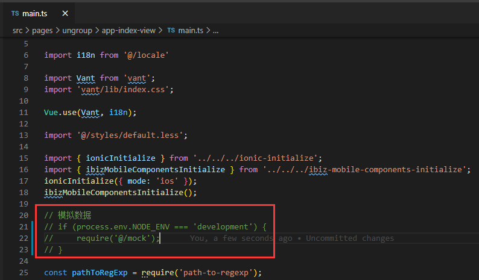

#  Vue_Mobile_R7

Vue_Mobile_R7 是【**一套基于Vue全家桶（Vue + Vue-router + Vuex）前端框架**】的跨平台解决方案，支持一次开发，发布到 Android、iOS、H5、钉钉、微信等多个平台中使用。

本文档主要介绍项目如何快速上手，成果物代码结构做一阐述，旨在能够为开发人员提供一定开发指导支持。而今框架开源，希望能有更多志同道合的伙伴参与 Vue_Mobile_R7 的迭代 `^_^`。

## 开发环境要求

- Node.js

- Yarn

- Vue Cli

## 开发技术要求

掌握`Vue`、`TypeScript`、`less`、`html`等技术。

## 技术栈

- 前端MVVM框架：`vue.js ^2.6.11 `

- 路由：`vue-router ^3.1.5` 

- 状态管理：`vuex ^3.1.2` 

- 国际化：`vue-i18n ^8.15.5` 

- 数据交互：`axios ^0.19.2` 

- UI框架：`@ionic/core ^5.0.5`, `vant ^2.5.4`

- 工具库：`qs ^6.9.1`, `path-to-regexp ^6.1.0`, `rxjs ^6.5.4`,`moment ^2.24.0`,`async-validator^3.3.0` 

- 图标库：`font-awesome 4.7.0`, `ionicons ^5.0.1` 

- 引入组件： `echarts ^4.6.0`，`ibiz-mobile-components`

- 代码风格检测：`tslint`


# 快速上手

### 1. 开发环境

> 在安装使用 `Yarn` 和 `Vue Cli (3.0)` 前，务必确认 [Node.js](https://nodejs.org) 已经升级到 v4.8.0 或以上，强烈建议升级至最新版本。
> 如果你想了解更多 `Yarn` 工具链的功能和命令，建议访问 [Yarn](https://yarnpkg.com) 了解更多。
> 如果你想了解更多 `Vue Cli (3.0)` 工具链的功能和命令，建议访问 [Vue Cli (3.0)](https://cli.vuejs.org/) 了解更多。

- 访问 [Node.js](https://nodejs.org) ，根据文档安装 `Node.js`。
- 访问 [Yarn](https://yarnpkg.com) ，根据文档安装 `Yarn`。
- 访问 [Vue Cli (3.0)](https://cli.vuejs.org/) ，根据文档安装 `Vue Cli (3.0)`。

<blockquote style="border-color: red;"><p>在安装 Vue Cli (3.0) ,请使用 Yarn 模式全局安装。</p></blockquote>
```bash
$ yarn global add @vue/cli
```

### 2. 安装依赖

打开前端项目，进入工作空间下，执行安装依赖命令

```bash
$ yarn install
```

### 3. 远程代理

修改远程代理文件 vue.config.js 代理地址

​	

注释掉main.ts文件中的 mock数据服务	


# 

### 4. 启动

通过 vue.config.js 开发服务 devServer 下配置的本地启动端口号访问开发项目。<br>
示例: 

```bash
$ http://localhost:8111
```
在工作空间下，执行启动命令

```bash
$ yarn serve
```

这儿需要注意一点，此时启动的项目访问的数据是我们前端的 mock 数据，如需与后台直接交互，请看第3点。


# 编译及打包

### 1.Web App 编译

在工作空间下，执行命令，进行生产编译。

```bash
$ yarn build
```

编译完成，生成最终交付产物，交付产物文件目录配置文件 .env.production 内容如下如下：

```sh
NODE_ENV=production
VUE_APP_CURRENTMODE='production'
outputDir='****'
```

### 2.Android 打包

Vue_Mobile_R7 解决方案使用  capacitor 作为混合开发工具。 Capacitor 提供调用原生开发，打包等功能。修改刚才目录下  `capacitor.config.json` 服务端地址，再 url  中设置服务器地址以及端口号，修改参数如下：

```json
{
    ********
    "server": {
        "url": "#########"
    },
    *********
}
```

混合打包配置文件内容如下：

```
NODE_ENV=production
VUE_APP_CURRENTMODE=hybridapp
VUE_APP_OUTPUTDIR=www
VUE_APP_PROXY=#########
```

修改配置文件 .env.hybridapp 下 VUE_APP_PROXY 参数值，编译前端工程：

```sh
$ yarn build-hybrid-app
```

拷贝编译成果到 andorid 工程目录下：

```bash
$ yarn cap copy
```

更新 android 打包依赖插件

```bash
$ yarn cap update
```

打开 Android Studio，执行打包

```bash
$ yarn cap open android
```

# 成果物结构

```
app                                               应用名称
├── public                                        应用公共资源目录（图片，json 文件等）
├── src                                           工程文件目录
│   ├── app-core                                  应用核心包目录
│   │   ├── code-list                             应用代码表目录
│   │   │   ├── ****.ts                           **** 代码表
│   │   ├── counter                               应用计数器目录
│   │   │   ├── ****                              **** 计数器目录
│   │   │   │   ├── ****-counter-base.ts          **** 计数器基类
│   │   │   │   └── ****-counter.ts               **** 计数器自定义文件
│   │   │   └── counter-service-constructor.ts    计数器服务构造器
│   │   ├── ctrl-model                            部件模型目录
│   │   │   ├── app                               应用部件模型目录
│   │   │   │   ├── ****-model.ts                 **** 部件模型
│   │   │   ├── ****                              **** 应用实体部件目录
│   │   │   │   ├── ****-model.ts                 **** 部件模型
│   │   ├── ctrl-service                          部件服务目录 
│   │   │   ├── app                               应用部件服务目录
│   │   │   │   ├── ****-service.ts               **** 部件服务
│   │   │   ├── ****                              **** 应用实体部件目录
│   │   │   │   ├── ****-service.ts               **** 部件服务
│   │   └── service                               服务目录
│   │       ├── app                               应用服务目录
│   │       │   └── code-list-service.ts          应用代码表服务
│   │       ├── ****                              应用实体 **** 服务目录
│   │       │   ├── ****-service-base.ts          应用实体 **** 基类        
│   │       │   └── ****-service.ts               应用实体 **** 自定义文件
│   │       └── app-entity-service-constructor.ts 应用服务构造器
│   ├── components                                应用基础组件
│   ├── engine                                    应用引擎
│   ├── environments                              应用环境变量
│   ├── global-ui-service                         应用全局行为服务目录
│   │   ├── global-ui-service-base.ts             应用全局行为服务基类
│   │   ├── global-ui-service-constructor.ts      应用全局行为服务构造器
│   │   └── global-ui-service.ts                  应用全局行为服务自定义文件
│   ├── ibiz-core                                 埃毕致应用核心包目录
│   │   ├── app-service                           应用服务
│   │   ├── code-list                             代码表目录
│   │   │   └── code-list-base.ts                 代码表公共逻辑
│   │   ├── control-service                       部件服务目录
│   │   │   ├── ****-service-base.ts              **** 部件服务公共逻辑
│   │   ├── counter                               计数器服务目录
│   │   │   └── counter-service-base.ts           计数器服务公共逻辑
│   │   ├── service                               应用实体服务逻辑与本地数据库逻辑
│   │   ├── third-party-service                   第三方集成服务
│   │   ├── ui-service                            行为服务目录
│   │   │   └── ui-logic-base.ts                  行为逻辑公共基类
│   │   ├── utils                                 工具包
│   │   ├── wf-ui-service                         工作流行为服务目录
│   │   │   └── wf-ui-action-base.ts              工作流行为服务基类             
│   ├── interface                                 接口
│   ├── locale                                    多语言
│   ├── mock                                      模拟数据
│   ├── model                                     预置模型目录
│   │   ├── form-detail                           表单模型
│   │   └── panel-detail                          面板模型
│   ├── pages                                     视图
│   │   └── ****                                  应用模块 **** 目录
│   │       └── ****-view                         **** 应用视图目录
│   │           ├── ****-view-base.vue            **** 应用视图基类
│   │           ├── ****-view.less                **** 应用视图样式
│   │           └── ****-view.vue                 **** 应用视图自定义
│   ├── store                                     状态管理
│   ├── styles                                    样式
│   ├── ui-service                                应用行为服务目录
│   │   └── ****                                  **** 应用实体
│   │       ├── ****-ui-action-base.ts            **** 应用实体行为基类
│   │       └── ****-ui-action.ts                 **** 应用实体行为自定义文件
│   ├── utils                                     工具包
│   ├── widgets                                   应用部件目录
│   │   ├── app                                   非应用实体部件目录
│   │   │   └── ****                              **** 应用部件目录
│   │   │       ├── ****-base.vue                 **** 应用部件基类
│   │   │       ├── ****.less                     **** 应用部件样式
│   │   │       └── ****.vue                      **** 应用部件自定义文件
│   │   └── ****                                  **** 应用实体目录
│   │       └── ****                              **** 应用部件目录
│   │           ├── ****-base.vue                 **** 应用部件基类
│   │           ├── ****.less                     **** 应用部件样式
│   │           └── ****.vue                      **** 应用部件自定义文件
│   ├── app-initialize.ts                         应用初始化文件
│   ├── app-register.ts                           应用组件注册
│   ├── App.vue                                   入口                           
│   └── user-register.ts                          用户自定义组件注册
├── .browserslistrc                               浏览器支持
├── package.json                                  依赖包文件
├── tsconfig.json                                 typescript 配置
├── tslint.json                                   typescript 代码检测配置
├── vue.config.js                                 vue cli 配置
└── yarn.lock                                     依赖包版本锁定
```

# 更新日志

每个版本的详细更改都记录在[发行说明](CHANGELOG.md)中。

# 如何贡献

如果你希望参与贡献，欢迎 [Pull Request](<http://demo.ibizlab.cn/ibiz_r7/vue_r7/issues/new>)，或通过自助服务群给我们报告 Bug。

强烈推荐阅读 [《提问的智慧》](https://github.com/ryanhanwu/How-To-Ask-Questions-The-Smart-Way)(本指南不提供此项目的实际支持服务！)、[《如何向开源社区提问题》](https://github.com/seajs/seajs/issues/545) 和 [《如何有效地报告 Bug》](https://www.chiark.greenend.org.uk/~sgtatham/bugs-cn.html)、[《如何向开源项目提交无法解答的问题》](https://zhuanlan.zhihu.com/p/25795393)，更好的问题更容易获得帮助。

# 社区互助

1.[iBizLab论坛](https://bbs.ibizlab.cn/)