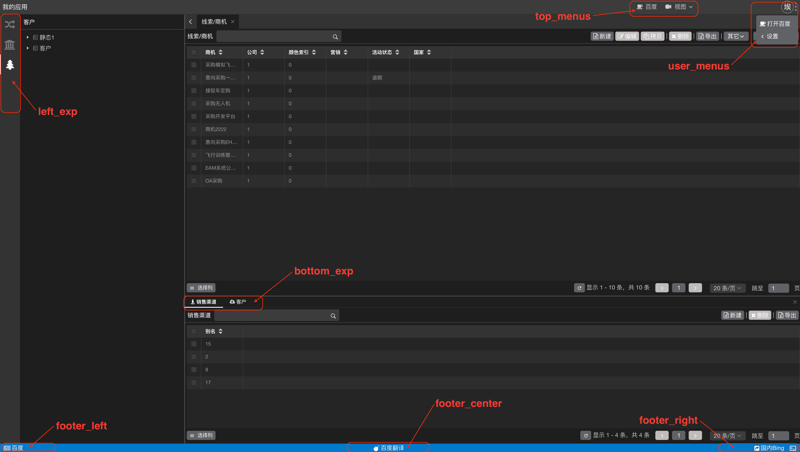
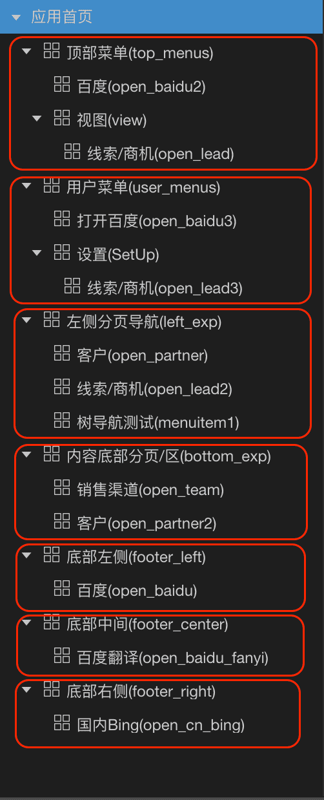
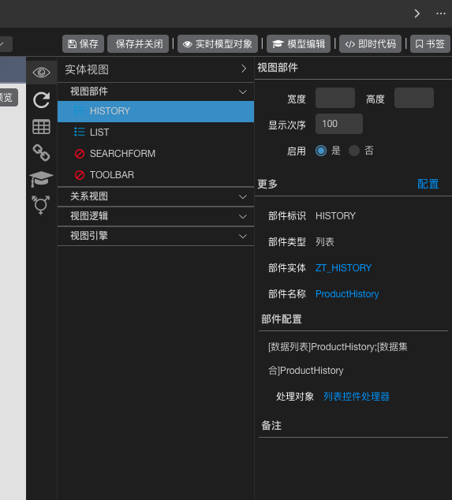
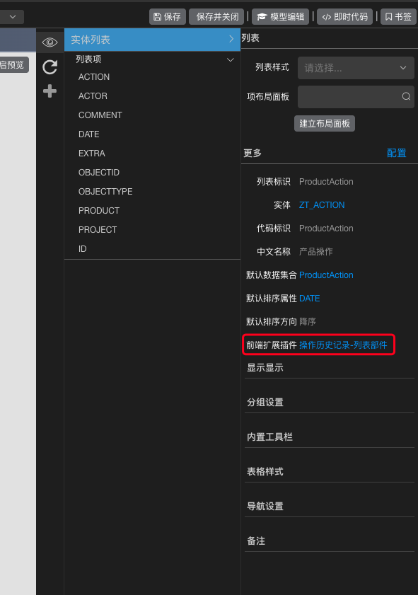
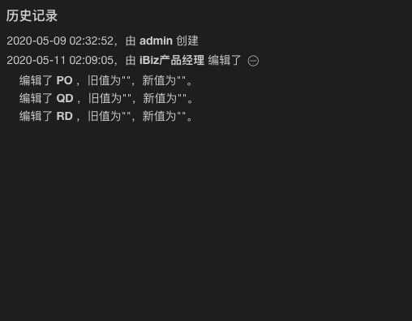

# 特殊配置

## 首页

  1. 首页基本结构示例及说明：

     

     首页总共可配置7处菜单，7处菜单取自首页菜单的第一层指定名称项下内容，具体可看2配置示例。

     「left_exp、bottom_exp、footer_left、footer_center、footer_right」这5种菜单只支持展示一层。

     「top_menus、user_menus」支持展示2层菜单。

  2. 首页配置示例

     

## 操作历史记录列表

  1. 新建插件，插件标识为：ActionHistory

     

  2. 新建列表视图，列表视图内需两个列表部件：

     部件标识分别为：LIST、HISTORY

     1. LIST：配置为Action实体的数据源

        展示需要的列表项：id、action、actor、date、objecttype、

     2. HISTORY：配置为History实体的数据源

        展示需要的列表项：id、action、field、new、old、diif

     

     需在LIST部件对应的数据列表中，选择刚建立好的插件：

     

  3. 最终效果示例：

     